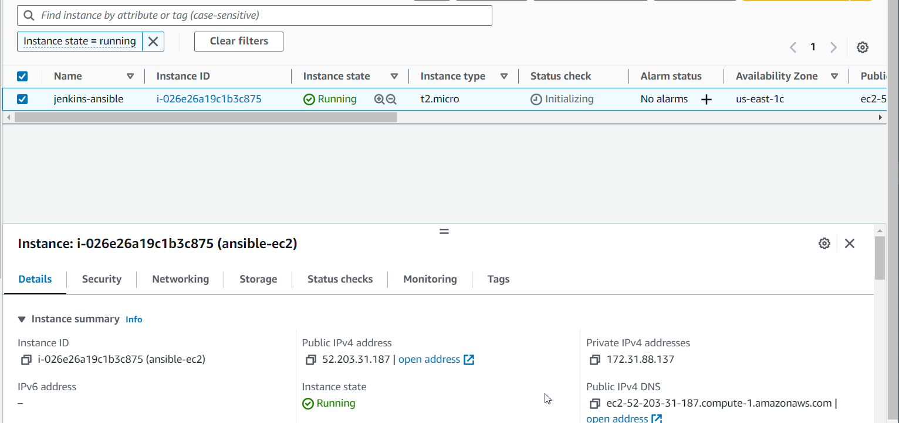
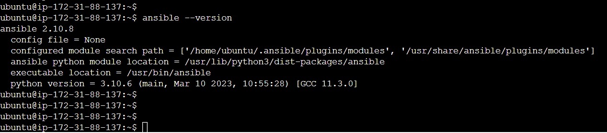
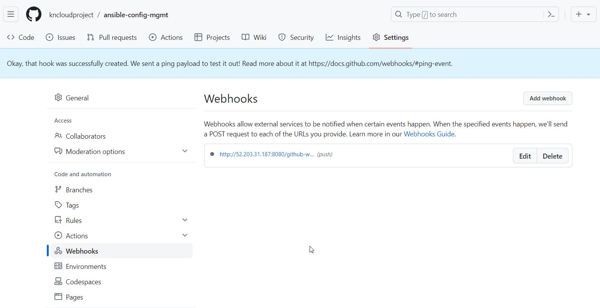

# Create EC2 with Ubuntu



```yml
sudo apt update
sudo apt install ansible
```



- Installing JDK which is an important Java based package required for Jenkins to run.


```yml
sudo apt install default-jdk-headless
```

```
wget -q -O - https://pkg.jenkins.io/debian-stable/jenkins.io.key | sudo apt-key add -
sudo sh -c 'echo deb https://pkg.jenkins.io/debian-stable binary/ > \
    /etc/apt/sources.list.d/jenkins.list'
sudo apt update
sudo apt-get install jenkins

sudo systemctl enable jenkins
sudo systemctl start jenkins
sudo systemctl status jenkins
```

- Since Jenkins runs on default port 8080, open this port on the Security Group inbound rule of the jenkins server on AWS


- Login to Jenkins server: <jenkins_server_public_ip_address>:8080

## Attaching WebHook to Jenkins Server
On the github repository that contains application code, create a webhook to connect to the jenkins job. To create webhook, go to the settings tab on the github repo and click on webhooks. Webhook should look like this:

<public_ip_of_jenkins_server>:8080/github-webhook/



## Creating Job and Configuring GIT Based Push Trigger

- On the jenkins server, create a new freestyle job
In configuration of the Jenkins freestyle job choose Git repository, provide there the link to the GitHub repository and credentials (user/password) so Jenkins could access files in the repository. Also specify the branch containing code


# Ansible refactoring and static assignments (imports androles)
- In this project I will continue working with `ansible-config-mgt` repository and make some improvements by refactoring the Ansible code, create assignments, and learn how to use the imports functionality. Imports allow to effectively re-use previously created playbooks in a new playbook. It allows you to organize your tasks and reuse them when needed.
  
  > Refactoring is a general term in computer programming. It means making changes to the source code without changing expected behaviour of the software. The main idea of refactoring is to enhance code readability, increase maintainability and extensibility, reduce complexity, add proper comments without affecting the logic.

### Step 1: Jenkins Job Enhancement
  
  1. `sudo mkdir /home/ubuntu/ansible-config-artifact`

  2. `chmod -R 0777 /home/ubuntu/ansibleconfig-artifact`
  3. Go to Jenkins web console -> Manage Jenkins -> Manage Plugins -> on Available tab search for Copy Artifact and install this plugin without restarting Jenkins
  4. Create a new Freestyle project and name it `save_artifacts`
  5. This project will be triggered by completion of your existing ansible project. Configure it accordingly.
  6. The main idea of `save_artifacts` project is to save artifacts into `/home/ubuntu/ansible-config-artifact` directory. To achieve this, create a `Build` step and choose Copy artifacts from other project , specify ansible as a source project and `/home/ubuntu/ansible-config-artifact` as a target directory.
  7.  Test your set up by making some change in README.MD Øle inside your  `ansible-config-mgt` repository (right inside master branch)


### Step 2: Refactor Ansible code by importing other playbooks into `site.yml`
```yml
---
- hosts: all
- import_playbook: ../static-assignments/common.yml
```

```yml
├── static-assignments
│   └── common.yml
├── inventory
    └── dev
    └── stage
    └── uat
    └── prod
└── playbooks
    └── site.yml
```


```yml
---
- name: update web, nfs and db servers
  hosts: webservers, nfs, db
  remote_user: ec2-user
  become: yes
  become_user: root
  tasks:
  - name: delete wireshark
    yum:
      name: wireshark
      state: removed

- name: update LB server
  hosts: lb
  remote_user: ubuntu
  become: yes
  become_user: root
  tasks:
  - name: delete wireshark
    apt:
      name: wireshark-qt
      state: absent
      autoremove: yes
      purge: yes
      autoclean: yes
```
- update `site.yml` with `- import_playbook: ../static-assignments/common-del.yml` instead of `common.yml` and run it against dev servers:

### Step 3: Configure uat webservers with a role webserver
```yml
mkdir roles
cd roles
ansible-galaxy init webserver

```

```yml
└── webserver
    ├── README.md
    ├── defaults
    │   └── main.yml
    ├── files
    ├── handlers
    │   └── main.yml
    ├── meta
    │   └── main.yml
    ├── tasks
    │   └── main.yml
    ├── templates
    ├── tests
    │   ├── inventory
    │   └── test.yml
    └── vars
        └── main.yml
```

```yml
└── webserver
    ├── README.md
    ├── defaults
    │   └── main.yml
    ├── handlers
    │   └── main.yml
    ├── meta
    │   └── main.yml
    ├── tasks
    │   └── main.yml
    └── templates
```
- Update your inventory `ansible-config-mgt/inventory/uat.yml` fle with IP addresses of your 2 UAT Web servers
